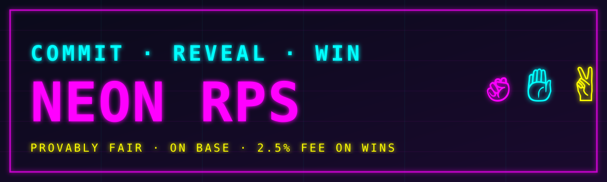

<div align="center">



# Neon RPS

**The fairest on-chain Rock-Paper-Scissors ever built.**
Commit your move cryptographically. Reveal when your opponent is locked in. Winner takes 97.5% of the pot. Zero front-running possible.

[](https://basescan.org/address/0x2F2e814aFd9DEb94a23b990725E5C6EF67fC7AAD)
[](https://basescan.org/address/0x2F2e814aFd9DEb94a23b990725E5C6EF67fC7AAD#code)
[](lib/contracts)
[](lib/contracts/test)
[](artifacts/rps-game)

[](artifacts/rps-game)
[](artifacts/rps-game)
[](.)
[](backend)
[](artifacts/rps-game/src/lib/wagmi.ts)
[](artifacts/rps-game)
[](artifacts/rps-game)
[](backend/onramp.py)
[](LICENSE)

[**🎮 Play Now**](https://neonrps.xyz) · [**📜 Contract**](https://basescan.org/address/0x2F2e814aFd9DEb94a23b990725E5C6EF67fC7AAD#code) · [**📊 Treasury**](https://neonrps.xyz/treasury) · [**🐦 X**](https://x.com/agunnaya001)

</div>

---

## ✨ What's Inside

| | |
|---|---|
| 🔐 **Commit-Reveal** | `keccak256(player, move, salt)` makes front-running mathematically impossible. |
| 💰 **Real ETH on Base** | Live on Base mainnet (chain id `8453`). Tiny ~$0.001 gas, 2 s blocks. |
| 🎯 **97.5% to Winner** | 2.5% protocol fee on **wins only** — ties and cancels are completely free. |
| ⏱️ **24h Reveal Timeout** | Opponent ghosted? Claim the entire pot via `claimByDefault`. |
| 💳 **Built-in On-Ramp** | "Buy Base ETH" button → Coinbase Onramp opens with Base + ETH preselected. No KYC for us. |
| 📲 **PWA + Native Share** | Install to home screen. Mobile share sheet. Haptic feedback. |
| 🎁 **Referral Loop** | Every share-link is auto-stamped with `?ref=<address>` and persists for 30 days. |
| 🏆 **Live Leaderboard** | Pure on-chain event indexing — zero RPC reads per game. |
| 📊 **Public Treasury** | 24h / 7d / projected monthly revenue from on-chain `FeeCollected` events. |

---

## 🏆 Why Commit-Reveal?

Every naive on-chain RPS is **trivially exploitable** — the second player sees the first player's move in the mempool and picks the winning counter. Commit-reveal eliminates this:

```
1. COMMIT  →  keccak256(you, move, salt)   ← stored on-chain, move invisible
2. REVEAL  →  move + salt verified on-chain ← cannot lie, committed to it
3. PAYOUT  →  winner gets 97.5% of pot     ← 2.5% protocol fee on wins only
```

The salt is 32 random bytes generated in your browser via `crypto.getRandomValues` and stored in `localStorage`. You never touch it manually.

---

## 🔗 Deployment

| Network | Contract | Status |
|---------|----------|--------|
| **Base Mainnet** — `CommitRevealRPS v3` | [`0x2F2e814aFd9DEb94a23b990725E5C6EF67fC7AAD`](https://basescan.org/address/0x2F2e814aFd9DEb94a23b990725E5C6EF67fC7AAD#code) | ✅ Live & Verified |
| **Base Mainnet** — `BestOfThreeRPS v1` | [`0x053ac43369DE4B87987689d1cb352A15AB771c40`](https://basescan.org/address/0x053ac43369DE4B87987689d1cb352A15AB771c40#code) | ✅ Live & Verified |
| Treasury Wallet | [`0xFfb6505912FCE95B42be4860477201bb4e204E9f`](https://basescan.org/address/0xFfb6505912FCE95B42be4860477201bb4e204E9f) | 2.5% fee recipient |
| Sepolia (legacy) | `0xEd992aD017878DdB67E7d431f53EaF862f034BA6` | ⚠️ Superseded |

---

## ⚙️ How a Game Flows

```
Player 1                         Contract                         Player 2
   │                                │                                │
   │── createGame(commit, bet) ────►│                                │
   │                                │◄── joinGame(id, commit, bet) ──│
   │── reveal(id, move, salt) ─────►│                                │
   │                                │◄── reveal(id, move, salt) ─────│
   │                                │                                │
   │                                │── resolve, pay winner ────────►│
   │                                │── collect 2.5% fee ───────────►│ feeRecipient
```

### Game Phases

| Phase | Description |
|-------|-------------|
| `WAITING` | Created, open for any opponent to join. |
| `ACTIVE`  | Both committed, waiting for both to reveal. |
| `RESOLVED` | Winner paid, game complete. |
| `TIED` | Same move on both sides — both refunded, no fee. |
| `CANCELLED` | Creator cancelled before anyone joined. |

### Timeout Protection
- If a player hasn't revealed within **24 h**, the opponent calls `claimByDefault` and takes the entire pot.
- The UI shows a live countdown timer and the claim button appears automatically when the deadline passes.

---

## 🧱 Architecture

```
                 ┌──────────────────────────────────────────────────────────┐
                 │                       neonrps.xyz                        │
                 └──────────────────────────────────────────────────────────┘
                                            │
                              ┌─────────────┴─────────────┐
                              │                           │
                  ┌───────────▼───────────┐   ┌───────────▼─────────────┐
                  │   Vite + React 19     │   │   FastAPI (port 8001)   │
                  │   (port 3000)         │   │                         │
                  │                       │   │  • /api/onramp/session  │
                  │  wagmi + viem         │   │    (Ed25519 JWT → CDP)  │
                  │  framer-motion        │   │  • proxy /api/* →       │
                  │  Tailwind v4          │   │    Node Express (8002)  │
                  │  PWA + Web Share API  │   │    └ /api/og/game/:id   │
                  │                       │   │    └ /api/share/g/:id   │
                  └───────────┬───────────┘   │    └ /api/healthz       │
                              │               └─────────────────────────┘
                              │
                              ▼
                  ┌──────────────────────────┐
                  │   Base Mainnet           │
                  │   chain 8453             │
                  │                          │
                  │   CommitRevealRPS v3     │
                  │   BestOfThreeRPS v1      │
                  └──────────────────────────┘
```

### Workspace Layout

```
.
├── artifacts/
│   ├── rps-game/         # Frontend — React + Vite + wagmi
│   ├── api-server/       # Express OG card / share-meta server
│   └── mockup-sandbox/   # Design playground
├── lib/
│   ├── contracts/        # Hardhat + Solidity (CommitRevealRPS, BestOfThreeRPS)
│   ├── db/               # Drizzle ORM schema (currently unused at runtime)
│   ├── api-spec/         # OpenAPI source-of-truth + Orval codegen
│   ├── api-zod/          # Zod runtime schemas
│   └── api-client-react/ # Typed React Query hooks generated from OpenAPI
├── backend/              # FastAPI adapter (spawns Node + Onramp endpoint)
│   ├── server.py
│   └── onramp.py
└── frontend/             # Thin yarn-startable wrapper around the Vite app
```

---

## 🚀 Quickstart (Local)

### Prereqs
- Node 20+
- pnpm 10
- Python 3.11
- MongoDB (only required for the platform — the app itself doesn't touch it)

### Install + Run

```bash
# 1. Install everything
git clone https://github.com/agunnaya001/neon-rps.git
cd neon-rps
pnpm install                              # workspace deps for monorepo
pip install -r backend/requirements.txt   # FastAPI + Coinbase JWT signer

# 2. Configure environment
cat > artifacts/rps-game/.env <<EOF
VITE_CONTRACT_ADDRESS=0x2F2e814aFd9DEb94a23b990725E5C6EF67fC7AAD
VITE_CHAIN_ID=8453
VITE_WALLETCONNECT_PROJECT_ID=<your-32-char-projectId>
EOF

cat > backend/.env <<EOF
CONTRACT_ADDRESS=0x2F2e814aFd9DEb94a23b990725E5C6EF67fC7AAD
BASE_RPC_URL=https://mainnet.base.org
NODE_API_PORT=8002
CDP_API_KEY_NAME=<your-cdp-key-id>
CDP_API_KEY_SECRET=<your-base64-ed25519-secret>
EOF

# 3. Build the API server (esbuild)
pnpm --filter @workspace/api-server run build

# 4. Run (two terminals)
cd backend  && uvicorn server:app --host 0.0.0.0 --port 8001 --reload   # tab 1
cd ../frontend && yarn start                                            # tab 2

# → open http://localhost:3000
```

### Smart Contracts

```bash
cd lib/contracts
DO_NOT_TRACK=1 npx hardhat compile
DO_NOT_TRACK=1 npx hardhat test          # 58/58 tests
DO_NOT_TRACK=1 npx hardhat run scripts/deploy-bot3.ts --network base
```

---

## 🔐 Coinbase Onramp Setup

The "BUY BASE ETH" button mints a real Coinbase-hosted Onramp session URL. To enable it:

1. Create a project at [portal.cdp.coinbase.com](https://portal.cdp.coinbase.com)
2. Enable **Onramp** for the project
3. Create a **Secret API Key** (NOT a Client key)
4. Add `https://neonrps.xyz` to the **Domain Allowlist**
5. Paste the key into `backend/.env`:
   ```env
   CDP_API_KEY_NAME=organizations/<org-uuid>/apiKeys/<key-uuid>   # or just the UUID
   CDP_API_KEY_SECRET=<base64-ed25519-private-key>
   ```

The backend signs Ed25519 JWTs (`backend/onramp.py`), calls `POST https://api.developer.coinbase.com/onramp/v1/token`, and returns the hosted purchase URL with **Base + ETH preselected** and **the connected wallet pre-filled**.

---

## 🌐 Environment Variables

| Variable | Where | Purpose |
|---|---|---|
| `VITE_CONTRACT_ADDRESS` | `artifacts/rps-game/.env` | CommitRevealRPS mainnet address |
| `VITE_CHAIN_ID` | `artifacts/rps-game/.env` | Chain ID (`8453` = Base) |
| `VITE_WALLETCONNECT_PROJECT_ID` | `artifacts/rps-game/.env` | WalletConnect v2 projectId — get one free at [cloud.walletconnect.com](https://cloud.walletconnect.com) |
| `CONTRACT_ADDRESS` | `backend/.env` | Read by the Node OG/share server |
| `BASE_RPC_URL` | `backend/.env` | Base RPC (default `https://mainnet.base.org`) |
| `NODE_API_PORT` | `backend/.env` | Internal port for Express (default `8002`) |
| `CDP_API_KEY_NAME` | `backend/.env` | Coinbase Developer Platform key name/UUID |
| `CDP_API_KEY_SECRET` | `backend/.env` | Base64 Ed25519 secret |
| `DEPLOYER_PRIVATE_KEY` | shell | Hardhat deploy wallet (if redeploying contracts) |
| `BASESCAN_API_KEY` | shell | BaseScan contract verification |

---

## 📡 HTTP API

| Method | Path | Purpose |
|---|---|---|
| `GET`  | `/api/healthz` | Liveness probe |
| `GET`  | `/api/health` | Adapter health + `node_api` boolean |
| `GET`  | `/api/og/game/:id` | 1200×630 PNG OG card (SVG → `@resvg/resvg-js`, reads chain via viem) |
| `GET`  | `/api/share/g/:id` | HTML page with OG/Twitter meta + auto-redirect to `/game/:id` |
| `POST` | `/api/onramp/session` | Mint a Coinbase Onramp session URL. Body: `{ wallet_address, partner_user_ref? }` |

---

## 🎨 UI Routes (Frontend)

| Path | Description |
|---|---|
| `/` | Lobby — your games, open duels, history, network activity, "Share & Earn" referral panel |
| `/create` | Move picker, live fee/payout breakdown, `?bet=X` rematch prefill, haptic feedback |
| `/leaderboard` | Event-indexed top players (zero per-game RPC calls) |
| `/treasury` | Public revenue dashboard: last 24h/7d/projected monthly, 7-day bar chart, `withdrawFees` trigger |
| `/game/:id` | Commit-reveal flow, cancel, reveal countdown, claim-by-default, confetti on win, share-to-X, rematch. Shows a **404 GAME NOT FOUND** card for non-existent IDs. |

---

## 📲 Mobile-First Enhancements

- **Web Share API** — taps the native iOS/Android share sheet on supported devices, falls back to copy-link elsewhere.
- **Haptic feedback** — `navigator.vibrate(15)` on move selection, `(30)` on link copy.
- **PWA manifest** — 8 icon sizes (72–512 px), 2 shortcuts (`New Duel`, `Leaderboard`).
- **InstallPrompt component** — surfaces "Add to home screen" affordance on supported browsers.
- **Viewport-fit cover** — respects iPhone notch / safe areas.
- **Responsive layout** — `flex-col md:flex-row` patterns throughout, single-column on phones.

---

## 🎁 Referral System

Every outbound share link is automatically stamped with `?ref=<your-wallet>`. Mechanics:

1. **Capture** — when a user lands on `https://neonrps.xyz/?ref=0xabc…`, the referrer is stored in `localStorage` with a 30-day TTL.
2. **Display** — a small `REFERRED BY 0xabc…1234` pill appears on the home screen (gratitude UX).
3. **Attribute** — the user's own share links and the in-game **Share Duel** dialog auto-append their `?ref=` so every viral hop is attributed.
4. **No contract changes** — purely client-side until we ship on-chain referral splits in a future iteration.

See `artifacts/rps-game/src/lib/referral.ts` and `components/ReferralPanel.tsx`.

---

## 💰 Protocol Economics

| Outcome | Fee | Notes |
|---------|-----|-------|
| Win | **2.5 %** of total pot (both bets combined) | Goes to `feeRecipient` (treasury wallet) |
| Tie | 0 % | Full refund |
| Cancel | 0 % | Full refund to creator |

Treasury is **publicly auditable** — anyone can call `withdrawFees()` and funds always route to the fixed `feeRecipient` address. No rug possible.

---

## 🧪 Tests

```bash
# Smart contracts (Hardhat)
cd lib/contracts && DO_NOT_TRACK=1 pnpm test           # 58 / 58 ✅

# Backend (pytest)
cd backend && pytest tests/                            # 7 / 7 ✅

# Linters
pnpm typecheck                                         # all packages
ruff check backend/                                    # python
```

Backend test suite covers:
- `/api/healthz`, `/api/health` (adapter + node_api flag)
- `/api/og/game/:id` PNG validation (header + size)
- `/api/share/g/:id` OG meta-tag presence + http-equiv refresh
- `/api/onramp/session` happy path **and** validation errors (missing wallet, invalid eth address)

---

## 🛠️ Built With

- **Frontend**: React 19 · Vite 7 · wagmi v3 · viem v2 · TailwindCSS v4 · framer-motion · wouter · sonner · lucide-react · canvas-confetti · vite-plugin-pwa · workbox
- **API server**: Express 5 · viem · @resvg/resvg-js · satori · pino
- **Adapter**: FastAPI · httpx · PyJWT · cryptography (Ed25519)
- **Smart contracts**: Solidity 0.8.24 · Hardhat · ethers v6 · OpenZeppelin
- **Database (codegen)**: Drizzle ORM · drizzle-zod · Orval
- **Validation**: Zod v4

---

## 🗺️ Roadmap

- [x] CommitRevealRPS v3 deployed + verified on Base mainnet
- [x] BestOfThreeRPS v1 deployed + verified on Base mainnet
- [x] PWA with installable app and 8 icon sizes
- [x] Live treasury dashboard with 7-day revenue chart
- [x] OG share cards (1200 × 630 PNG, per-game)
- [x] **Coinbase Onramp** — in-app "Buy Base ETH" with Base + ETH preselected
- [x] **404 GAME NOT FOUND** fallback on `/game/:id`
- [x] **Referral system** — `?ref=` URL tagging + 30-day localStorage attribution
- [x] **Web Share API** + haptic feedback for mobile engagement
- [ ] `/onramp-complete` landing page + Coinbase Transaction Status polling
- [ ] On-chain referral splits (smart-contract level)
- [ ] Tournament bracket mode
- [ ] ERC-20 bets (USDC on Base)
- [ ] Native mobile apps (Expo)

---

## 🤝 Contributing

PRs welcome. Open an issue first for substantial changes.

```bash
pnpm install
pnpm typecheck
pnpm --filter @workspace/contracts test
```

Code style: Prettier + Ruff. Don't add `console.log` in server code — use `req.log` / `logger`. Always pass `DO_NOT_TRACK=1` when running Hardhat scripts (bypasses telemetry TTY prompt).

---

## 📄 License

MIT © [@agunnaya001](https://github.com/agunnaya001)

---

<div align="center">

**Built on [Base](https://base.org) · Powered by commit-reveal cryptography · Deployed on [Emergent](https://emergent.sh)**

[**🎮 Play Now**](https://neonrps.xyz) · [**📜 Contract**](https://basescan.org/address/0x2F2e814aFd9DEb94a23b990725E5C6EF67fC7AAD#code) · [**🐦 @agunnaya001**](https://x.com/agunnaya001)

</div>
