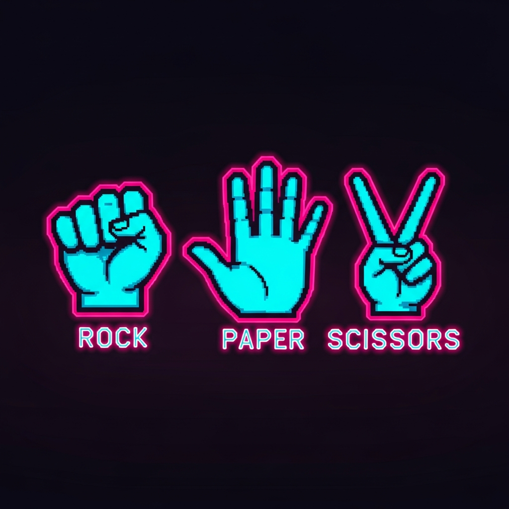

<div align="center">



# NEON RPS

**Front-running-resistant Rock-Paper-Scissors. Commit. Reveal. Win the pot.**

[](https://sepolia.etherscan.io/address/0xeE10D066AF750b6A7743029D11CC9cc4aB461418)
[](https://sepolia.etherscan.io/address/0xeE10D066AF750b6A7743029D11CC9cc4aB461418#code)
[](https://soliditylang.org/)
[](https://react.dev/)
[](https://vitejs.dev/)
[](https://wagmi.sh/)
[](https://viem.sh/)
[](https://hardhat.org/)
[](#tests)
[](#license)

</div>

---

## What is this?

NEON RPS is a two-player, on-chain Rock-Paper-Scissors duel where **both players post a bet and the winner takes the entire pot**. The catch: a naive on-chain RPS is trivially front-runnable — anyone can watch your move in the mempool and pick the winning counter.

This contract solves that with a **commit-reveal scheme**:

1. **Commit.** Each player submits `keccak256(abi.encode(playerAddress, move, salt))` — a hash that hides their move and salt.
2. **Reveal.** After both commitments are locked in, each player reveals their move + salt. The contract re-hashes and verifies it matches the commitment.
3. **Settle.** When both moves are revealed, the contract automatically pays the winner `2 × bet`. On a tie, both players are refunded.

The salt is generated client-side and stored in `localStorage` so the user never has to handle it manually.

## Live demo

- **App:** the deployed Replit app (this repo)
- **Contract (Sepolia):** [`0xeE10D066AF750b6A7743029D11CC9cc4aB461418`](https://sepolia.etherscan.io/address/0xeE10D066AF750b6A7743029D11CC9cc4aB461418#code) (verified)
- **Need test ETH?** [Sepolia faucet](https://www.alchemy.com/faucets/ethereum-sepolia)

## Features

- **Commit-reveal hashing** with per-player address binding (prevents commitment swapping)
- **Custom errors** for cheap, structured revert reasons
- **Open-games index** with O(1) swap-and-pop removal
- **Tie refunds** + winner-takes-all payouts
- **wagmi + viem** wallet connection (any injected wallet — MetaMask, Rabby, etc.)
- **Local salt store** keyed by `(gameId, playerAddress)`
- **Open lobby**, **My games**, and per-game detail/reveal flow
- **Arcade-styled UI** — neon, CRT scanlines, Orbitron typography

## Stack

| Layer | Tech |
|---|---|
| Smart contract | Solidity 0.8.24, Hardhat, ethers v6 |
| Frontend | React 18, Vite 7, TypeScript, TailwindCSS v4 |
| Web3 | wagmi 2, viem 2 |
| UI | shadcn/ui, framer-motion, lucide-react |
| Testing | Hardhat + chai |

## Repo layout

```
.
├── lib/contracts/                    # Hardhat workspace
│   ├── contracts/CommitRevealRPS.sol
│   ├── test/CommitRevealRPS.test.ts  # 13 tests
│   └── scripts/deploy.ts
└── artifacts/rps-game/               # React + Vite frontend
    └── src/
        ├── pages/                    # Home, CreateGame, GameDetail
        ├── hooks/                    # useGames, useGameActions
        └── lib/                      # contract.ts, salt-store.ts, wallet.ts, wagmi.ts
```

## How the commitment works

```solidity
bytes32 commitment = keccak256(abi.encode(player, move, salt));
```

Binding `player` into the hash means a malicious user **can't copy another player's commitment and reveal it as their own** — the contract recomputes the hash with `msg.sender` and rejects mismatches.

The salt is a 32-byte random value generated in the browser via `crypto.getRandomValues` and persisted in `localStorage` under the key `rps:commit:<gameId>:<address>`.

## Game state machine

```
Empty ──createGame──► WaitingForOpponent ──joinGame──► WaitingForReveals
                                                            │
                                       ┌────────────────────┤ both revealed
                                       ▼                    ▼
                                 Refunded (tie)        Resolved (winner paid)
```

## Run locally

### Prerequisites
- Node 20+, pnpm 9+
- A wallet (MetaMask) with Sepolia ETH for the live contract, or run a local Hardhat node

### Install
```bash
pnpm install
```

### Run the contract tests
```bash
pnpm --filter @workspace/contracts run test
```

### Deploy to Sepolia
Set the env vars (in Replit Secrets, or `.env` for local):
```
DEPLOYER_PRIVATE_KEY=0x...
ETHERSCAN_API_KEY=...
SEPOLIA_RPC_URL=https://...   # optional, defaults to a public node
```

```bash
pnpm --filter @workspace/contracts run deploy --network sepolia
```

The script prints the deployed address and the env values to drop into the frontend.

### Verify on Etherscan
```bash
cd lib/contracts
npx hardhat verify --network sepolia <DEPLOYED_ADDRESS>
```

### Run the frontend
Create `artifacts/rps-game/.env`:
```
VITE_CONTRACT_ADDRESS=0xeE10D066AF750b6A7743029D11CC9cc4aB461418
VITE_CHAIN_ID=11155111
```

The dev workflow `artifacts/rps-game: web` is auto-started by Replit. Open the preview pane and connect a wallet on Sepolia.

### Run a fully local chain
```bash
pnpm --filter @workspace/contracts run node          # terminal 1
pnpm --filter @workspace/contracts run deploy:local  # terminal 2
# paste the printed VITE_CONTRACT_ADDRESS into artifacts/rps-game/.env (chain 31337)
```

## Tests

13 tests in `lib/contracts/test/CommitRevealRPS.test.ts` cover:

- Game creation, open-list bookkeeping, swap-and-pop removal
- Joining (wrong bet, joining own game, wrong phase)
- Commit/reveal happy path for all 9 (Rock|Paper|Scissors)² combinations
- Commitment-mismatch rejection (wrong move, wrong salt, wrong player)
- Tie refunds and winner payout (`2 × bet`)
- `computeCommitment` view-helper parity with on-chain verification

```bash
pnpm --filter @workspace/contracts run test
```

## Contract API

| Function | Purpose |
|---|---|
| `createGame(bytes32 commitment) payable returns (uint256)` | Open a new game with a hidden move and a bet |
| `joinGame(uint256 gameId, bytes32 commitment) payable` | Join an open game by matching the bet |
| `reveal(uint256 gameId, Move move, bytes32 salt)` | Reveal your move; auto-resolves when both have revealed |
| `getGame(uint256) view returns (Game)` | Fetch a game's full state |
| `getOpenGames() view returns (uint256[])` | Lobby of joinable games |
| `computeCommitment(address, Move, bytes32) pure returns (bytes32)` | Helper for off-chain hashing |

## Security notes

- Players are identity-bound into the commitment hash to prevent commitment replay.
- Reveal does **not** have a timeout — a malicious player can grief by never revealing. A future version could add a per-game deadline + slash-the-no-show mechanism.
- The contract holds no fee — entire pot goes to the winner.
- Tested with optimizer `runs: 200`.

## License

MIT — see LICENSE.
