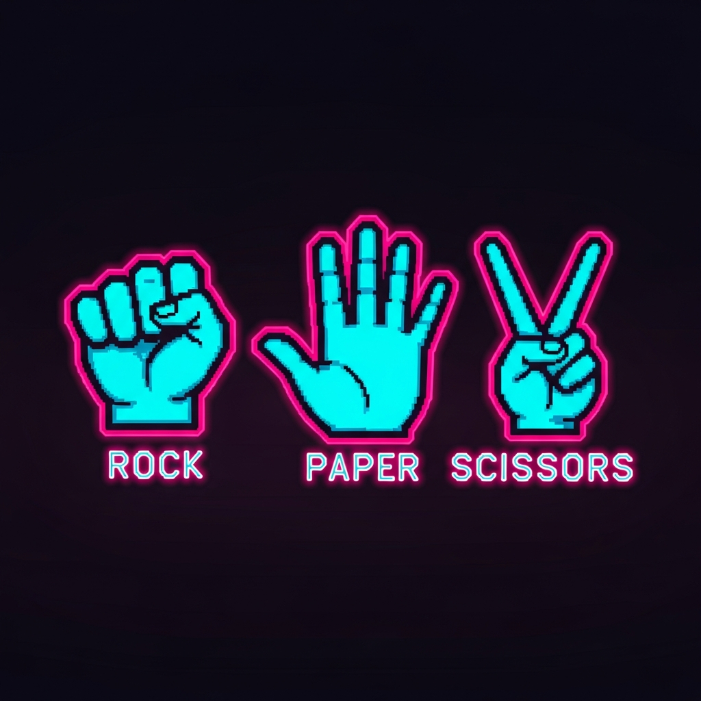

<div align="center">



# RPS.bet

**The fairest on-chain Rock-Paper-Scissors ever built.**  
Commit your move cryptographically. Reveal when your opponent is locked in. Winner takes the pot. Zero front-running possible.

[](https://basescan.org/address/0x2F2e814aFd9DEb94a23b990725E5C6EF67fC7AAD)
[](https://basescan.org/address/0x2F2e814aFd9DEb94a23b990725E5C6EF67fC7AAD#code)
[](lib/contracts)
[](lib/contracts/test)
[](artifacts/rps-game)
[](LICENSE)

[**Play Now →**](https://rps-bet.replit.app) · [**Contract on BaseScan →**](https://basescan.org/address/0x2F2e814aFd9DEb94a23b990725E5C6EF67fC7AAD#code) · [**Treasury →**](https://rps-bet.replit.app/treasury)

</div>

---

## 🏆 Why Commit-Reveal?

Every naive on-chain RPS is **trivially exploitable** — the second player sees the first player's move in the mempool and picks the winning counter. Commit-reveal eliminates this:

```
1. COMMIT  →  keccak256(you, move, salt)   ← stored on-chain, move invisible
2. REVEAL  →  move + salt verified on-chain ← cannot lie, committed to it
3. PAYOUT  →  winner gets 97.5% of pot     ← 2.5% protocol fee on wins only
```

The salt is 32 random bytes generated in your browser and stored in `localStorage`. You never touch it manually.

---

## 🔗 Deployment

| Network | Address | Status |
|---------|---------|--------|
| **Base Mainnet** | [`0x2F2e814aFd9DEb94a23b990725E5C6EF67fC7AAD`](https://basescan.org/address/0x2F2e814aFd9DEb94a23b990725E5C6EF67fC7AAD#code) | ✅ Live & Verified |
| Sepolia (legacy) | `0xEd992aD017878DdB67E7d431f53EaF862f034BA6` | ⚠️ Superseded |

---

## ⚙️ How a Game Flows

```
Player 1                         Contract                         Player 2
   │                                │                                │
   │── createGame(commit, bet) ────►│                                │
   │                                │◄── joinGame(id, commit, bet) ──│
   │── reveal(id, move, salt) ─────►│                                │
   │                                │◄── reveal(id, move, salt) ─────│
   │                                │                                │
   │                                │── resolve, pay winner ────────►│
   │                                │── collect 2.5% fee ───────────►│ feeRecipient
```

### Game Phases

| Phase | What it means |
|-------|--------------|
| `WAITING` | Created, open for any opponent to join |
| `ACTIVE` | Both committed, waiting for both to reveal |
| `RESOLVED` | Winner paid, game complete |
| `CANCELLED` | Creator cancelled before anyone joined |

### Timeout Protection
- If a player hasn't revealed within **24 hours**, the opponent can call `claimByDefault` and take the entire pot.
- The UI shows a live countdown timer and the claim button appears automatically when the deadline passes.

---

## 💰 Protocol Revenue

| Outcome | Fee |
|---------|-----|
| Win | **2.5%** of total pot (both bets combined) |
| Tie | **0%** — full refund, no fee |
| Cancel | **0%** — full refund, no fee |
| Claim by default | **2.5%** of pot |

**Fee recipient:** [`0xFfb6505912FCE95B42be4860477201bb4e204E9f`](https://basescan.org/address/0xFfb6505912FCE95B42be4860477201bb4e204E9f)

### Treasury Dashboard (`/treasury`)
The Treasury page shows live on-chain revenue data:
- **Pending fees** ready to withdraw (anyone can trigger, always routes to fee recipient)
- **Last 24h / 7-day revenue** read directly from `FeeCollected` on-chain events
- **7-day bar chart** of daily earnings
- **Projected monthly** income based on 7-day rolling average
- Lifetime collected and withdrawn stats

---

## 🎮 Frontend Features

| Feature | Details |
|---------|---------|
| **Arcade-neon UI** | Pixel font, neon glows, dark CRT theme |
| **WalletConnect** | MetaMask, Coinbase Wallet, Rainbow, Trust Wallet |
| **PWA** | Install to iOS/Android/desktop home screen |
| **OG share cards** | 1200×630 PNG game cards via Express API for social sharing |
| **Confetti on win** | Particle celebration when you take the pot |
| **Rematch button** | One-click create at same bet, pre-filled via `?bet=X` |
| **Claim by default** | Live reveal countdown, auto-claim CTA when deadline passes |
| **Leaderboard** | On-chain win/loss/profit aggregated from events |
| **Treasury dashboard** | Live revenue analytics for protocol owner |
| **NetworkBanner** | Prompts to switch to Base if on wrong chain |

---

## 🏗️ Architecture

```
artifacts-monorepo/
├── artifacts/
│   ├── rps-game/           # React + Vite + wagmi v2 + TailwindCSS v4
│   └── api-server/         # Express 5  (OG image cards + share routes)
├── lib/
│   ├── contracts/          # Hardhat · CommitRevealRPS.sol (v3)
│   ├── db/                 # PostgreSQL + Drizzle ORM
│   └── api-spec/           # OpenAPI spec + Orval codegen
└── scripts/                # Utility scripts
```

### Tech Stack

| Layer | Technology |
|-------|-----------|
| Smart contract | Solidity 0.8.24, Hardhat, ethers v6 |
| Chain | **Base Mainnet** — EVM L2, ~$0.001/tx, 2s blocks |
| Frontend | React 18, Vite 7, wagmi v2, viem v2, TailwindCSS v4 |
| Wallet | WalletConnect v2 + MetaMask/injected |
| API | Express 5, @resvg/resvg-js (server-side OG PNG rendering) |
| Database | PostgreSQL + Drizzle ORM |
| Monorepo | pnpm workspaces, TypeScript 5.9 |
| PWA | Web App Manifest, Service Worker, apple-touch-icon |

---

## 🚀 Local Development

### Prerequisites
- Node.js 24+
- pnpm 9+
- PostgreSQL (for the API server)

### Setup

```bash
git clone https://github.com/YOUR_USERNAME/rps-bet
cd rps-bet
pnpm install

# Push DB schema (dev only)
pnpm --filter @workspace/db run push

# Each service runs via Replit workflows, or manually:
pnpm --filter @workspace/rps-game run dev        # Frontend
pnpm --filter @workspace/api-server run dev       # API
```

### Environment Variables

| Variable | Value |
|----------|-------|
| `VITE_CONTRACT_ADDRESS` | `0x2F2e814aFd9DEb94a23b990725E5C6EF67fC7AAD` |
| `VITE_CHAIN_ID` | `8453` |
| `SESSION_SECRET` | Random 32-byte hex |
| `DATABASE_URL` | PostgreSQL connection string |

### Typecheck

```bash
pnpm run typecheck        # full workspace typecheck
pnpm --filter @workspace/contracts run test    # 26 contract tests
```

---

## 🔒 Smart Contract API

```solidity
// Create a game — ETH bet goes to contract escrow
function createGame(bytes32 commitment) external payable returns (uint256 gameId)

// Join an existing game — must match exact bet amount
function joinGame(uint256 gameId, bytes32 commitment) external payable

// Reveal your move after both players have committed
function reveal(uint256 gameId, Move move, bytes32 salt) external

// Cancel before anyone joined — full refund
function cancelGame(uint256 gameId) external

// If opponent didn't reveal in 24h — claim entire pot
function claimByDefault(uint256 gameId) external

// Withdraw pending fees to feeRecipient — anyone can call
function withdrawFees() external

// Owner only: update fee rate (max 5%)
function setFeeBps(uint16 _feeBps) external onlyOwner

// Owner only: update fee destination
function setFeeRecipient(address _feeRecipient) external onlyOwner
```

### Generating a Commitment (Client-Side)

```typescript
import { keccak256, encodeAbiParameters, parseAbiParameters } from "viem";
import { generateSalt } from "@/lib/salt-store";

const salt = generateSalt();  // crypto.getRandomValues — 32 bytes
const commitment = keccak256(
  encodeAbiParameters(
    parseAbiParameters("address, uint8, bytes32"),
    [playerAddress, move, salt]
  )
);
```

---

## 📣 Contract Events

```solidity
event GameCreated(uint256 indexed gameId, address indexed player1, uint256 bet);
event GameJoined(uint256 indexed gameId, address indexed player2);
event GameResolved(uint256 indexed gameId, address indexed winner, uint256 payout);
event Cancelled(uint256 indexed gameId);
event FeeCollected(uint256 indexed gameId, uint256 amount);
event FeesWithdrawn(address indexed to, uint256 amount);
event FeeBpsUpdated(uint16 oldBps, uint16 newBps);
event FeeRecipientUpdated(address indexed oldRecipient, address indexed newRecipient);
```

---

## 🧪 Tests

```
pnpm --filter @workspace/contracts run test

  CommitRevealRPS v3
    Deployment
      ✓ deploys with correct owner and fee config
      ✓ feeRecipient is set correctly
    Game lifecycle
      ✓ createGame stores commitment and emits GameCreated
      ✓ joinGame stores commitment and emits GameJoined
      ✓ cannot join own game
      ✓ cannot join with wrong bet amount
    Commit-reveal resolution
      ✓ Rock beats Scissors — winner gets payout minus fee
      ✓ Scissors beats Paper
      ✓ Paper beats Rock
      ✓ Tie — full refund, no fee collected
    Cancellation & timeouts
      ✓ cancelGame refunds creator, no fee
      ✓ claimByDefault after 24h reveal deadline
      ✓ cannot claimByDefault before deadline
    Protocol fees
      ✓ FeeCollected event emitted on win with correct amount
      ✓ pendingFees returns accumulated balance
      ✓ withdrawFees sends to feeRecipient
      ✓ withdrawFees callable by anyone
      ✓ setFeeBps reverts above 500 (5%)
      ✓ setFeeBps reverts for non-owner
      ✓ setFeeRecipient updates recipient
      ✓ setFeeRecipient reverts for non-owner
    Ownership
      ✓ transferOwnership transfers correctly
      ✓ new owner can update fee settings
    Views
      ✓ winnerPayout returns correct value
      ✓ revealDeadline returns joinedAt + 24h
      ✓ getOpenGames tracks open game ids

  26 passing (1.2s)
```

---

## 📱 PWA Install

The app is installable as a native-feeling app:

| Platform | How to install |
|----------|---------------|
| **iOS** | Safari → Share button → Add to Home Screen |
| **Android** | Chrome → ⋮ Menu → Add to Home Screen |
| **Desktop** | Click the install icon in the browser address bar |

An install banner slides up automatically for first-time visitors.

---

## 🗺️ Roadmap

- [ ] Tournament bracket mode (entry fees → prize pool)
- [ ] USDC bet support (ERC-20 on Base)
- [ ] Spectator mode (watch live duels)
- [ ] On-chain taunts / chat
- [ ] Season rankings with on-chain trophies (ERC-721)
- [ ] Mobile app (Expo + WalletConnect)
- [ ] Referral links with on-chain attribution

---

## 🔐 Security

- **Commitment binding**: player address is hashed into the commitment — prevents cross-player commitment replay attacks.
- **Escrow**: ETH is held by the contract until resolution — no custodial risk.
- **No admin drain**: `withdrawFees` only moves fees to the pre-set `feeRecipient`, never arbitrary addresses.
- **Max fee cap**: `setFeeBps` reverts if `_feeBps > 500` (5%) — players can always verify the cap is enforced.
- **Source verified**: contract is open-source and verified on BaseScan.

---

## 📜 License

MIT — free to fork, remix, and deploy your own instance.

---

<div align="center">

Built on **[Base](https://base.org)** · Secured by cryptographic commitments · Powered by **[viem](https://viem.sh)** + **[wagmi](https://wagmi.sh)**

</div>
